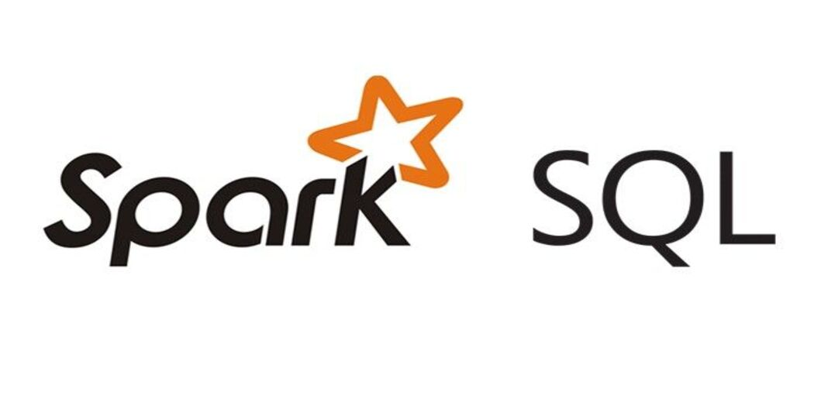

 

# Manipulacao de Dados com SparkSQL, PandaSQL, SQLAlchemy, PostgreSQL e Docker

# Objetivo
O objetivo deste laboratório é trabalhar em um exemplo completo de carga e manipulação de dados em um ambiente com diversas ferramentas, integrações, conexões e queries SQL.
Os dados utilizados foram extraídos do site abaixo:

  

https://datahub.io/collections/footbal

Para este projeto utilizaremos o Docker, pois queremos um container com o SGBD postgre SQL. Abaixo apresentamos os comandos a serem executados:

Incialiazando o Docker:

#### docker run -d -p 80:80 docker/getting-started

Criando a imagem

#### docker pull postgres

Inicializando um container docker chamado "dsa" com SGBD PostgreSQL, user "postgres" e senha "dsa123".

#### docker run --name dsa -e POSTGRES_PASSWORD=dsa123 -p 5432:5432 -d postgres

